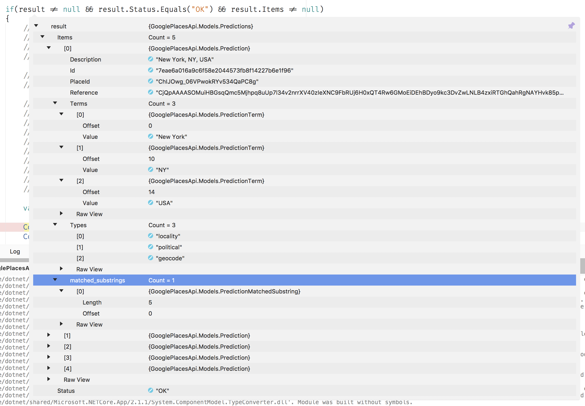

# Google Places Api

The Google Places API can be used to find locations and their details like geolocation, address and other data. It returns a predicted list of locations based on the input string. In this post I will show some details about the plugin I created.

# Introduction

More than a year ago I created a store locator in a Xamarin.Forms app with the [Google Places API](https://cloud.google.com/maps-platform/places/). I liked the simplicity and configurability of the API and already had the idea of creating a plugin to reuse the code. After releasing the app I never got back into the code and just forgot about it until last week when I had to implement almost exactly the same functionality in a different app. 

I don't like to repeat myself but because of the tight project schedule I just didn't have the time to create a public, readable and documented package but I had some time to spend during the weekend so I sat down and created the [Google Places Api](https://www.nuget.org/packages/GooglePlacesApi) nuget package.

# Before you start

The Google Places API needs to be enabled in the [developer console](https://console.cloud.google.com/) and also needs a valid paying account, although you won't be charged (depending of the level of details requested). Read more about billing [here](https://developers.google.com/places/web-service/usage-and-billing). 

If your application displays data from the Places API on a page or view that does not also display a Google Map, [you must show a Powered by Google logo](https://developers.google.com/places/web-service/policies#terms_of_use_and_privacy_policy_requirements) with that data.
 
# Using the plugin

Make sure you have enabled the Google Places Api in the [developers console](https://console.cloud.google.com/). Get an api Key and install the [nuget](https://www.nuget.org/packages/GooglePlacesApi) package in your project. 

## Using the settings builder

The plugin can be configured with different settings by using the settings builder:


```C#
var settings = GoogleApiSettings.Builder
                                            .WithApiKey("api_key")
                                            .WithLanguage("nl")
                                            .WithType(PlaceTypes.Address)
                                            .WithLogger(new ConsoleLogger())
                                            .AddCountry("nl")
                                            .Build();
```

Only the api key is required, all other settings are optional. Detailed information about the parameters is available [here](autocomplete) but in short:

* Language: two letter iso code. Results are biased to the selected language so setting it might give better results.

* Type: The types of place results to return. If no type is specified, all types will be returned.

* Countries: you can add up to 5 countries. Results will be restricted to locations in the provided country.

* Logger: this is not an API setting. If you want logging of the API calls and results you can implement your own logger or use the provided console logger.


## Calling the API for predictions

The request:  

```
var settings = GoogleApiSettings.Builder.WithApiKey("SAMPLE_API_KEY")                                            
                                            .WithType(PlaceTypes.GeoCode)
                                            .Build();

var service = new GooglePlacesApiService(settings);
var result = await service.GetPredictionsAsync("new y").ConfigureAwait(false);
```

The results:

[](./predictionresult.png)

## Getting details

The information in the returned result is not giving any detailed location information. To get more information about a location another API call is needed.

The request:

```
var details = await service.GetDetailsAsync("ChIJOwg_06VPwokRYv534QaPC8g")
                                      .ConfigureAwait(false);
```

The result:

[](./detailresult.png)

# Samples

Please check out the [sample](https://github.com/jacobduijzer/GooglePlacesApi/tree/master/src/samples/Xamarin.Forms) Xamarin Forms app, I created a simple view and a more advanced view with throttled search.