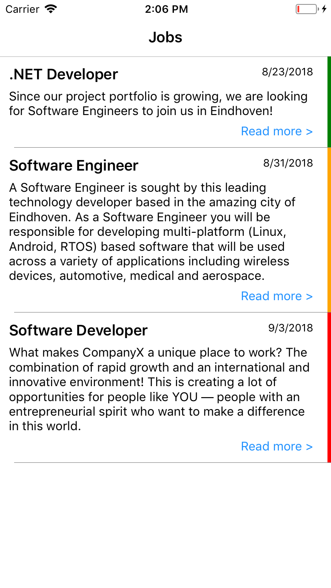
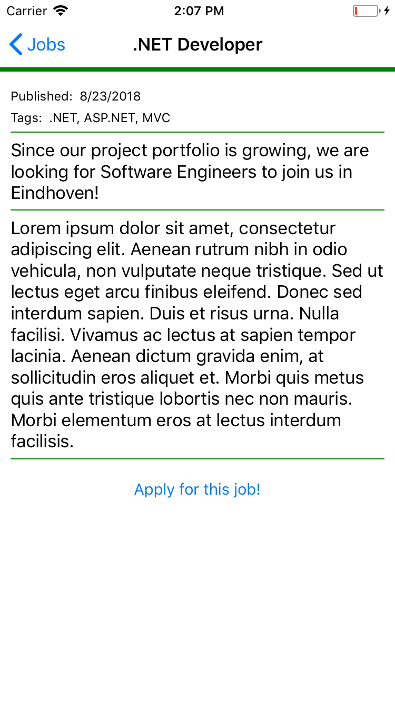
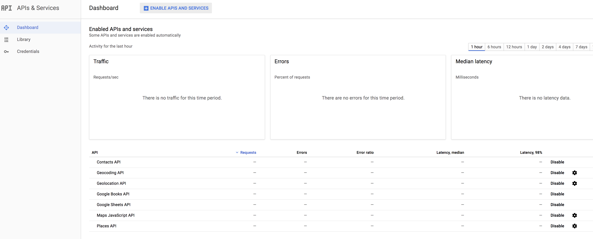
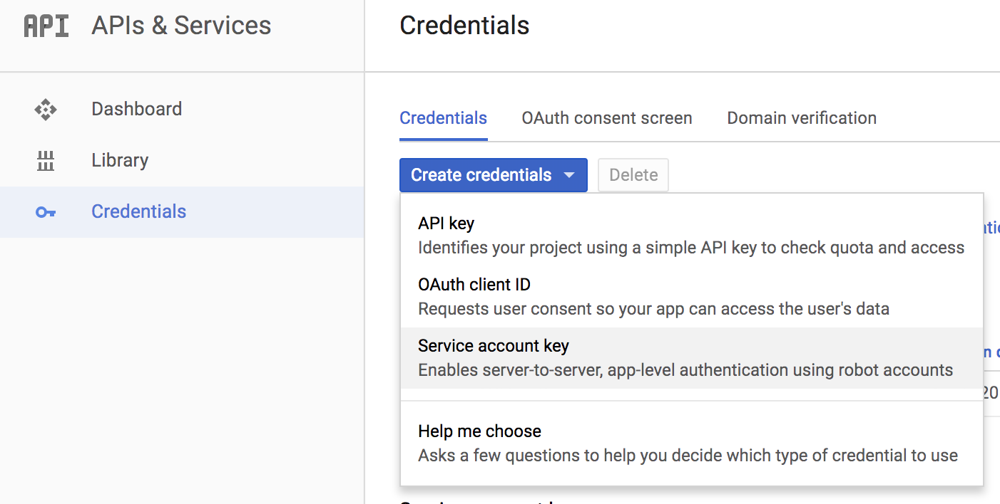
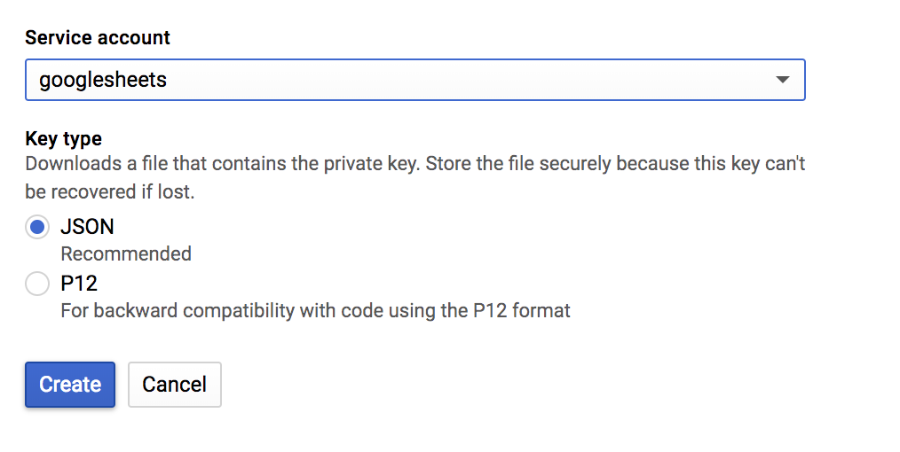
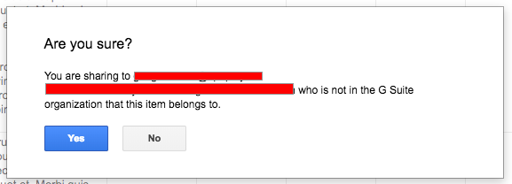
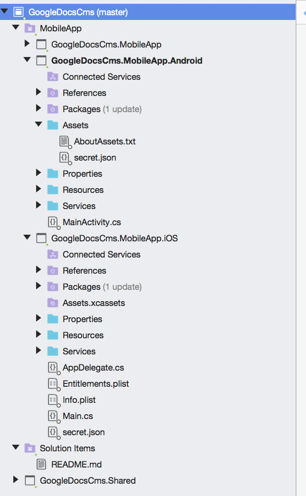

# Using Google Sheet as CMS for your App - Part 1

Imagine you had an easy to understand CMS without too much overhead, just to add translations and a bit of content for your (Xamarin) app. A CMS with an "excel-like" interface, an interface most of your customers would understand without even a training? Say "Hi" to Google Sheets & Azure Functions!

<!--more-->

Any time I start a new app project the same question arises: how do we maintain content in a (Xamarin) app:

* A CMS can be used but brings additional costs and might be overkill. It also might need a data connection to retrieve all content;
* Static translations or resource files is an option but makes it harder to change content.

Just recently I had a customer who literaly said: “I don’t want a CMS. It is slow, hard to maintain, difficult to quickly add new content. Can you use Google Docs?”. Just a few minutes of research and I had it up and running!

In this first part I will explain how to use a Google Sheet as a CMS for your Xamarin App by connecting your app straight to the Google Sheets API. In another post I will create a more reliable and professional API by adding Azure Functions as a proxy so we can add caching.

# The sample

For this post I will create a simple [app](https://github.com/jacobduijzer/GoogleDocsAsAppCms) with a list of jobs and a detail page. I will use Xamarin Forms to keep it simple and clean.

List             |  Details
:-------------------------:|:-------------------------:
[](./app_1.png)  |  [](./app_2.png)

# Enable the Google Sheets API

What needs to be done is this: in the [Google Developers Console](https://console.cloud.google.com/) the Google Sheets Api needs to be enabled:

[](./google_console.png)

The next step is to generate a secret json file:

[](./secret_1.png)

[](./secret_2.png)

Keep the secret.json file, we will use this later.

# Create a new Google Sheet

The sheet I use is simple:

[](./google_sheet.png)

To enable access for the Sheets API you have to add the API user's email to the share permissions.

* Copy the email address from the secret.json file
* click on Share (the blue button at the right top of the sheet) and add the email address:

[](./permissions_1.png)

[](./permissions_2.png)

# The App

I created a Xamarin Forms app and added the following nuget packages to the NetStandard core project

- [SheetToObjects.Lib](https://www.nuget.org/packages/SheetToObjects.Lib/)
- [SheetToObjects.Core](https://www.nuget.org/packages/SheetToObjects.Core/)
- [SheetToObjects.Adapters.GoogleSheets](https://www.nuget.org/packages/SheetToObjects.Adapters.GoogleSheets/)

[](./adding_packages.png)

Next I added the secret.json file to the iOS and Android project:

- for iOS, just add it to the root
- for Android, add it to the Assets folder

[](./added_json.png)

For Android set the Build Action to AndroidAsset:

[](./set_build_action.png)

## The JobService

The JobService is responsible for getting the content from the sheet and map it to the model. Set the required parameters and map the colums to the model:

```
var sheetData = await provider.GetAsync(filePath,
                                                    "Job offers", // sheet tab name
                                                    "SHEET ID", // The sheet id (from the url)
                                                    "A:G") // the range
                                          .ConfigureAwait(false);

            var sheetMapper = new SheetMapper().AddConfigFor<JobOffer>(cfg => cfg
                                                                       .MapColumn(column => column.WithHeader("Title").MapTo(m => m.Title))
                                                                       .MapColumn(column => column.WithHeader("Introduction").MapTo(m => m.Introduction))
                                                                       .MapColumn(column => column.WithHeader("Text").MapTo(m => m.Text))
                                                                       .MapColumn(column => column.WithHeader("Tags").MapTo(m => m.Tags))
                                                                       .MapColumn(column => column.WithHeader("Color").MapTo(m => m.Color))
                                                                       .MapColumn(column => column.WithHeader("Date").MapTo(m => m.Date))
                                                                       .MapColumn(column => column.WithHeader("Published")
                                                                                  .WithDefaultValue<bool>(true)
                                                                                  .MapTo(m => m.Published)));
```

If you look at the source you can see I use the DependencyService to get the file location of the secret file. The problem is that, AFAIK, it is not possible to access a file in Android by path since it is 'zipped' into the APK. I created a SecretService on [Android](https://github.com/jacobduijzer/GoogleDocsAsAppCms/blob/master/src/GoogleDocsCms/GoogleDocsCms.MobileApp.Android/Services/SecretService.cs) and [iOS](https://github.com/jacobduijzer/GoogleDocsAsAppCms/blob/master/src/GoogleDocsCms/GoogleDocsCms.MobileApp.iOS/Services/SecretService.cs) to fix this issue.

# What's next

I didn't show a lot of code. The code is simple anyway. It took me some time so sort a few things out:

- How to allow access from the API to the sheet (adding the email address from the json file!)
- How to read a json file in Android (with a work around to copy the contents from the asset file to a temp file)
- I added a implementation for protected sheets to the SheetToObjects](https://github.com/josdeweger/SheetToObjects) nuget package

I am going to write a post about adding Azure Functions between the app and the sheet as a proxy with caching. Next I will try to add a post about using the [HTTP ETag](https://en.wikipedia.org/wiki/HTTP_ETag) to prevent downloading unnecessary data.

Let me know if you have questions or ideas about using Sheets as a CMS! 

# Links

App source: [GitHub](https://github.com/jacobduijzer/GoogleDocsAsAppCms)

SheetToObjects library, created by Jos de Weger: [SheetToObjects](https://github.com/josdeweger/SheetToObjects)