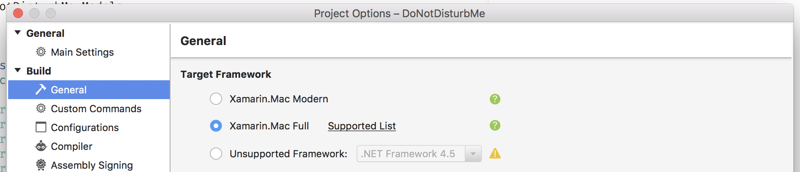

# Using an Arduino with Xamarin for Mac

It's all about first times: my first Xamarin.Mac app and my first Arduino connection with a Mac. I am going to explain how I connected an Arduino to a Xamarin.Mac app to create a ["pomodoro-like"](https://en.wikipedia.org/wiki/Pomodoro_Technique) timer.


<!--more-->

# Introduction

One of my colleagues was complaining about being disturbed a lot while working, having trouble keeping his focus. I have worked in a team with this exact same issue before, we came up with a simple solution: we bought some simple, small red flags on a stand. Put the flag up and your colleagues will know that you are busy. This worked for a while but everyone will forget to remove the flag and people will not know if you are really busy or not. 

I spend a few hours during the weekend and came up with the following: a contraption with a servo to raise a flag to show a "Do not disturb" message. A Xamarin.Mac app sends a signal to an Arduino to raise or lower the flag, the flag can be placed on your desk or your monitor. For the current prototype I used some Lego, I might create a better device later.


# The Xamarin.Mac App

The Mac app is fairly simple. It's my first Xamarin.Mac app so I know it can be refactored and cleaned up but it served it's purpose. There is no window, only a system icon with a menu.


Selecting "Test" makes it possible to easily test the functionallity, it changes the minutes into seconds.

**Important:** to be able to use the Arduino (or tty ports in general) you need to use the full Xamarin.Mac framework:

[](./full_xamarin_mac_framework.png)

I will just show some parts of the application. It is fairly straight forward. Please check the full code [here](https://github.com/jacobduijzer/DoNotDisturbMe).


To find (potential) arduino's use the ```System.IO.Ports.SerialPort```:

```
var ports = SerialPort.GetPortNames().Where(x => x.Contains("usbmodem"));
```

Opening a serial connection (it also flags the open port in the menu):

```
private void ConnectToArduino(string port)
{         
    try
    {
		UncheckArduinoMenuItems();
		
		TryCloseSerial();

        _serialPort = new SerialPort(port, 9600);
		if (_serialPort != null)
        {
			_serialPort.Open();
			if(_serialPort.IsOpen)
			{
				ArduinoPortsMenu.Submenu.ItemArray().FirstOrDefault(x => x.Title.Equals(port)).State = NSCellStateValue.On;
			}
        }
    }
    catch (Exception ex)
    {
    }
    finally
    {
		SetSystemIcon();
    }
}
```

Write some angles to the Arduino:

```
private void WriteDataToArduino(ArduinoCommands command)
{
	if(_serialPort != null && _serialPort.IsOpen)
	{
		switch(command)
		{
			case ArduinoCommands.Up:
				_serialPort.WriteLine("0");
				break;

			case ArduinoCommands.Down:
				_serialPort.WriteLine("255");
                break;

			case ArduinoCommands.Angle:
				_serialPort.WriteLine("angle");
				break;
		}
	}
}
```

# The Arduino code

The Arduino code is fairly simple. It waits for serial input which should contain the servo angle. It converts the string to an integer value and writes it to the servo.

```
#include <Servo.h>

String inputString = "";         // a String to hold incoming data
boolean stringComplete = false;  // whether the string is complete
int lastAngle;

Servo myServo;

void setup() 
{
  myServo.attach(9);
  myServo.write(0);
  Serial.begin(9600);
  inputString.reserve(200);
}

void loop() 
{
  if (stringComplete) 
  {
    if(inputString == "angle")
    {
      Serial.print(lastAngle);
    }
    else
    {
      Serial.print(inputString);
      
      lastAngle = inputString.toInt();
      
      myServo.attach(9);
      myServo.write(lastAngle);
      delay(250);
      myServo.detach(); 
    }
    
    
    // clear the string:
    inputString = "";
    stringComplete = false;
  }
}

void serialEvent() 
{
  while (Serial.available()) 
  {
    char inChar = (char)Serial.read();
    inputString += inChar;
    if (inChar == '\n') 
    {
      stringComplete = true;
    }
  }
}
```

# Links

Full source: [DoNotDisturbMe](https://github.com/jacobduijzer/DoNotDisturbMe)