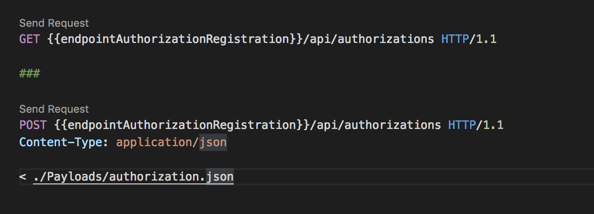
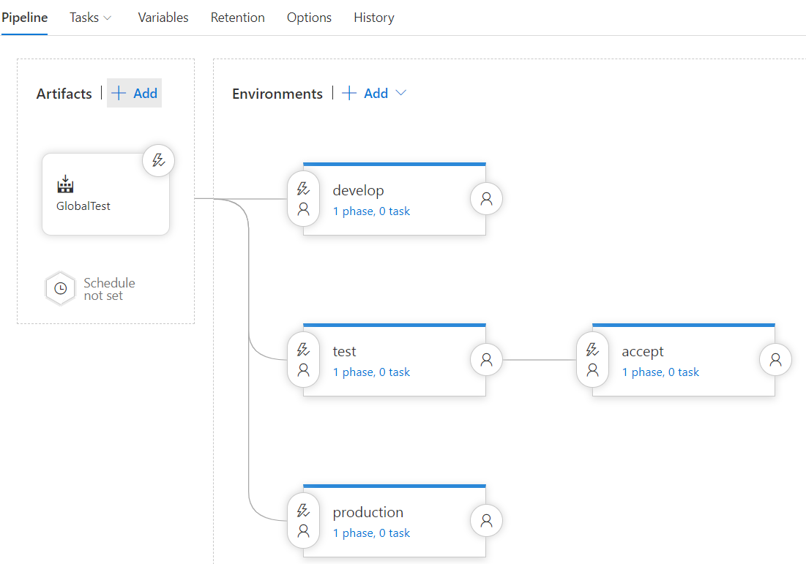

# Things I Learned This Week - #1

My plan was to write a quick post about some cool things I found and learned this week but I just learned too much (as I do every week). Below are just the highlights, I will try and write more posts like this, especially if I get some cool comments :) 

Read about a REST Client, Unit Testing, TFS and more in this post!

## REST Client for Visual Studio Code

I am working on a new project with a lot of API's and it seemed like nobody wanted to setup a new [Postman](https://www.getpostman.com/) environment. And, although Postman is quite a cool app, there are always issues when sharing projects within a team. Currently we are testing [REST Client](https://marketplace.visualstudio.com/items?itemName=humao.rest-client) with [Visual Studio Code](https://code.visualstudio.com/) and it looks quite promising. 

> REST Client allows you to send HTTP request and view the response in Visual Studio Code directly

A Screenshot of a .http file with two REST calls:

[](./restclient.png)

Why it is cool:

- Visual Studio Code, cross platform, fast
- Configurable with environments, scripts, variables
- You can keep the definitions of the API's within the codebase / repository. New features go hand in hand with changes in the definition.
- It implements an RFC ([RFC 2616](https://www.w3.org/Protocols/rfc2616/rfc2616-sec5.html)) and there are other compatible clients

## Assert the order of execution with MockSequence

I am using a handler to store some new information in a queue after which I want to raise an event to notify a service about the arrival of new data. The service will then start processing the new data. I wanted to verify in a unit test that the handler is executing the steps in the right order to prevent the notification being send before the data is stored. 

While doing some digging in the [Moq](https://github.com/moq/moq4) documentation I stumbled upon [MockSequence](http://www.nudoq.org/#!/Packages/Moq/Moq/MockSequence):



Now, when I change the order in the handler and run a test which touches any of the mocks, the test will fail because the order has changed!

## I have started to like TFS

The last few years I have mostly been using TeamCity. In fact, last year I tried to move from TeamCity to TFS for Xamarin builds and releases but after 5 minutes (really!) I stopped. Just recently I had to do some builds and releases of a web app with a newer version of TFS (16.x) and I am just starting to like TFS. There are some cool new features. It is now possible to reuse build and release steps, the different flows for releases are nice (and it looks cool).

I implemented a GitFlow style build and release. The build is triggered on all branches:

[](./tfs-1.png)

Then, when the build is finished, the release will trigger as follows:

- dev / feature branch build => Release to the develop environment
- release branch build => Release to the test environment. After testing one can approve and trigger a release to accept.
- master branch build => Release to production.

[](./tfs-2.png)

I have changed the flow a bit, the master branch will now trigger an accept release which have to be approved before the same build will release to the production environment. 

It seems like new releases of TFS [Azure DevOps Server](https://docs.microsoft.com/en-us/azure/devops/server/tfs-is-now-azure-devops-server?view=azure-devops) is even way cooler (did someone say yml?). I have been using Azure DevOps for some private projects but would really like yml files for my builds at work.

## Health checks with .NET Core 2.2

Never heard of it but it seems quite new: [health checks in .NET Core 2.2](https://www.nuget.org/packages/Microsoft.Extensions.Diagnostics.HealthChecks/). Just read [this post](https://medium.com/asos-techblog/implementing-net-core-2-2-health-checks-7f813fd71772), an excellent post which explains it all.

```csharp
services
    .AddHealthChecks()
    .AddCheck<DatabaseHealthCheck>("Database")
    .AddCheck<Api1HealthCheck>("Dependency API 1")
    .AddCheck<Api2HealthCheck>("Dependency API 2");
```

There are cool extensions to quickly check all services in your environment or all parts of your micro service. For example, a call to *some-api-url/healthcheck* can give a list with the status of your api, queue, database, job runners, etc.



## I love my MacBook with Visual Studio for Mac (2019)

Just some random love for my MacBook. I am working on a project with a large amount of Docker containers and my Windows laptop is suffering. I did some .NET Core work on my MacBook before but never with Docker containers. Getting the full project up and running (multiple .NET Core Web API's, postgresql databases, RabbitMQ queues and some other containers) took me about 15 minutes. Opening the project in Visual Studio for Mac worked instantly, all unit tests and integration tests turned green after a minute...

Ah, that was untrue. I was staring at my test results for a while before I remembered I had to click "Run All" to run my tests. I am missing a feature which I am using on Windows all day long: **Live Unit Testing**. 