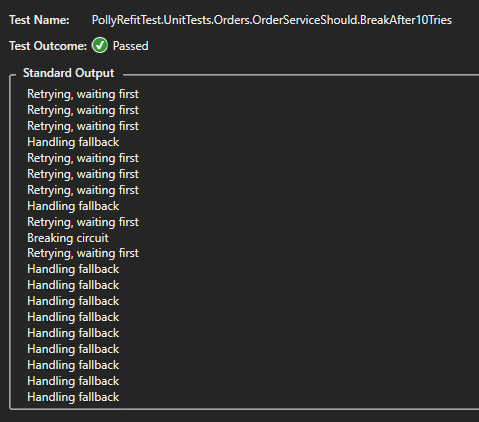

# Retry and fallback policies in C# with Polly

In this blog I will try to explain how one can create clean and effective policies to retry API calls and have fallbacks when requests are failing. With [Polly](https://github.com/App-vNext/Polly) it is possible to create complex and advanced scenarios for error handling with just a few lines of code.

This week I was connecting an eCommerce web application to an ERP system with REST APIs. There are multiple endpoints, all authenticated with OAuth. To make sure all calls to the APIs will have a high success rate I had to implement retry mechanisms for different scenarios.

For this kind of scenarios there is a very cool library: [Polly](https://github.com/App-vNext/Polly) which I have been using for some years now (together with [Refit](https://github.com/reactiveui/refit)) and I am just deeply in love with both libraries.

Although there are abundant resources about Polly on the web I wanted to write a post with a lot of sample code to provide a quick and practical example of how easy it is to use [Polly](https://github.com/App-vNext/Polly) to create advanced exception handling with APIs. I am using [Refit](https://github.com/reactiveui/refit) because it is quick and easy to use with REST APIs but Polly can be used with any kind of C# code.

Disclaimer: this article and sample code have nothing to do with the work I did for the eCommerce website. It was just a trigger for me to write about [Polly](https://github.com/App-vNext/Polly). Also, the shown code might not always show the best way to implementat things, it is just an example to explain some use cases of [Polly](https://github.com/App-vNext/Polly).

## What is Polly?

From the [Polly repository](https://github.com/App-vNext/Polly): Polly is a .NET resilience and transient-fault-handling library that allows developers to express policies such as Retry, Circuit Breaker, Timeout, Bulkhead Isolation, and Fallback in a fluent and thread-safe manner.

## How a simple API call can get way too complex

Let's say I have a micro service with an API endpoint to retrieve products:

```csharp

public class ProductService : IProductService
{
    private readonly IProductsApi _productsApi;

    public ProductService(IProductsApi productsApi) => _productsApi = productsApi;

    public async Task<Product> GetProducts() =>
        await _productsApi
        .GetProducts()
        .ConfigureAwait(false);
}

```

Could everything just be as simple as that. When you use code like this in a production environment you will quickly find out that there is a need of exception handling. And, even better, a mechanism to do some retries before throwing an exception.

So, let's add some simple retry (this is kind of pseudo-code, just for demonstration purpose):

```
public async Task<List<Product>> GetProducts()
{
    int tryCount = 0;
    while(tryCount < 3)
    {
        try
        {
            tryCount++;
            return await GetProductsAsync().ConfigureAwait(false);
        }
        catch (System.Exception)
        {
            await Task.Delay(500);
        }
    }

    throw new Exception("Something went wrong");
}

private async Task<List<Product>> GetProductsAsync() =>
    await _productsApi.GetProductsAsync().ConfigureAwait(false);
```

Although it is not the most beautiful code, it might actually work for you. But the next problem arises: the API is going to be protected with OAuth so we have to get an access token from another endpoint and provide a bearer token to be able to retrieve products. This will add quite a few extra scenarios where things can go wrong, the most commonly be timeouts and expiration of tokens.

Let's work on another revision of the code to add extra retries for these scenarios:

```csharp
public async Task<List<Product>> GetProducts()
{
    if(_authenticationResult == null)
        _authenticationResult = await _authenticationService.GetAccessToken().ConfigureAwait(false);

    int tryCount = 0;
    while(tryCount < 3)
    {
        try
        {
            tryCount++;
            return await GetProductsAsync(_authenticationResult.access_token).ConfigureAwait(false);
        }
        catch (ApiException ex)
        { 
            switch(ex.StatusCode)
            {
                case System.Net.HttpStatusCode.RequestTimeout:
                    await Task.Delay(500);
                    break;
                case System.Net.HttpStatusCode.Unauthorized:
                    _authenticationResult = await _authenticationService.GetAccessToken().ConfigureAwait(false);
                    break;
            }
            
        }
        catch(Exception ex)
        {

        }
    }

    throw new Exception("Something went wrong");
}

private async Task<List<Product>> GetProductsAsync(string accessToken) =>
    await _productsApi.GetProductsAsync(accessToken).ConfigureAwait(false);
```

I am going to stop right here. I should add another retry around the retrieval of the access token, handle more cases in the switch statement, in short, this simple API is becoming an unmaintainable mess. 

## Polly to the rescue

Let's try and implement the same scenario in a more clean and maintainable way by using Polly!

First, a simple version:

```csharp
public class ProductService : IProductService
{
    private readonly IProductsApi _productsApi;
    private readonly IAuthenticationService _authenticationService;

    private AuthenticationResult _authenticationResult;

    public ProductService(IProductsApi productsApi, IAuthenticationService authenticationService)
    {
        _productsApi = productsApi;
        _authenticationService = authenticationService;
    }

    private static readonly int NUMBER_OF_RETRIES = 3;

    public async Task<List<Product>> GetProducts()
    {
        if (_authenticationResult == null)
            _authenticationResult = await _authenticationService.GetAccessToken().ConfigureAwait(false);

        return await Policy
            .Handle<Exception>()
            .RetryAsync(NUMBER_OF_RETRIES)
            .ExecuteAsync(async () => await _productsApi.GetProductsAsync(_authenticationResult.access_token))
            .ConfigureAwait(false);
    }
}
```

The code is simple, it hardly needs further explanation. It will authenticate first (the authentication service itself will also use Polly) and try to get products. It will retry for a number of time when receiving any exception. While this is not a complete solution it can already handle some issues.

Let's extend it a bit. I want to add a delay when I receive a timeout. Maybe the API is spinning up, rebooting or there might be a network issue:

```csharp
return await Policy
    // When recieving a ApiException with status code 408
    .Handle<ApiException>(ex => ex.StatusCode == HttpStatusCode.RequestTimeout)
    // Retry NUMBER_OF_TIMES but execute some code before retrying
    .RetryAsync(NUMBER_OF_RETRIES, async (exception, retryCount) =>
    {
        // wait a while
        await Task.Delay(300).ConfigureAwait(false);
    })
    // execute the command
    .ExecuteAsync(async () => await _productsApi.GetProductsAsync(_authenticationResult.access_token))
    .ConfigureAwait(false);
```
           
But what if the API throws an exception because my access token is expired? This will be a different type of exception and it will also need a different solution to solve the problem. Polly is able to wrap different policies to handle different scenarios:

```csharp
public async Task<List<Product>> GetProducts()
{
    if (_authenticationResult == null)
        _authenticationResult = await _authenticationService.GetAccessToken().ConfigureAwait(false);

    var unauthorizedPolicy = Policy
        .Handle<ApiException>(ex => ex.StatusCode == HttpStatusCode.Unauthorized)
        .RetryAsync(async (exception, retryCount) =>
        {
            _authenticationResult = await _authenticationService.GetAccessToken().ConfigureAwait(false);
        });

    var timeoutPolicy = Policy
        .Handle<ApiException>(ex => ex.StatusCode == HttpStatusCode.RequestTimeout)
        .RetryAsync(NUMBER_OF_RETRIES, async (exception, retryCount) => 
            await Task.Delay(300).ConfigureAwait(false));

    return await unauthorizedPolicy
        .WrapAsync(timeoutPolicy)
        .ExecuteAsync(async () => await _productsApi.GetProductsAsync(_authenticationResult.access_token))
        .ConfigureAwait(false);
}
```

While this is not the way I would structure my code in a real app, I believe this is understandable and maintainable code. But how can we verify all these scenarios work? How can one simulate all the scenarios at a time to verify the behavior of all policies?

## Unit testing with Polly and Refit

This brings us to unit testing. Too me, this is one of the most important (and fun) parts. I do like writing unit tests but especially when programming difficult scenarios with APIs and policies. 

Imagine this: I want a retry on the authentication api but only when I receive a RequestTimeout (Http status code 408). This will be my full AuthenticationService:

```csharp
public class AuthenticationService : IAuthenticationService
{
    private static readonly int NUMBER_OF_RETRIES = 3;

    private readonly IAuthenticationApi _authenticationApi;
    private readonly string _clientId;
    private readonly string _clientSecret;

    public AuthenticationService(
        IAuthenticationApi authenticationApi,
        string clientId,
        string clientSecret
        )
    {
        Guard.Against.Null(authenticationApi, nameof(authenticationApi));
        Guard.Against.NullOrEmpty(clientId, nameof(clientId));
        Guard.Against.NullOrEmpty(clientSecret, nameof(clientSecret));

        _authenticationApi = authenticationApi;
        _clientId = clientId;
        _clientSecret = clientSecret;
    }

    public async Task<AuthenticationResult> GetAccessToken() =>
        await Policy
            .Handle<ApiException>(ex => ex.StatusCode == HttpStatusCode.RequestTimeout)
            .RetryAsync(NUMBER_OF_RETRIES, async (exception, retryCount) => await Task.Delay(500))
            .ExecuteAsync(async () => await _authenticationApi.GetAccessToken(_clientId, _clientSecret).ConfigureAwait(false))
            .ConfigureAwait(false);
} 
```

Now I can test the behavior with Moq to mock the API:

```csharp
[Fact]
public async Task RetryWhenReceivingTimeout()
{
    // ARRANGE
    var mockApi = new Mock<IAuthenticationApi>(MockBehavior.Strict);
    mockApi.SetupSequence(x => x.GetAccessToken(CORRECT_CLIENT_ID, CORRECT_CLIENT_SECRET))
        .Throws(TestHelper.CreateRefitException(HttpMethod.Post, HttpStatusCode.RequestTimeout))
        .Throws(TestHelper.CreateRefitException(HttpMethod.Post, HttpStatusCode.RequestTimeout))
        .ReturnsAsync(new AuthenticationResult { access_token = TEST_ACCESS_TOKEN });

    var service = new AuthenticationService(mockApi.Object, CORRECT_CLIENT_ID, CORRECT_CLIENT_SECRET);

    // ACT
    var authResult = await service.GetAccessToken().ConfigureAwait(false);

    // ASSERT
    authResult.Should().NotBeNull();
    authResult.access_token.Should().NotBeNullOrEmpty().And.Be(TEST_ACCESS_TOKEN);

    // The API Should have called GetAccessToken exactly 3 times: 2 times it received an exception,
    // the third time a correct result
    mockApi.Verify(x => x.GetAccessToken(It.IsAny<string>(), It.IsAny<string>()), Times.Exactly(3));
}
```

## Advanced scenarios

Let us dive a bit deeper into policies and [Polly](https://github.com/App-vNext/Polly) and combine different policies (and even add two more).

### Fallbacks

Let's say I created a micro service to create orders. We do not want to loose any order because this will directly result in money loss. A simple retry will not be enough because what if the order api is offline for a longer time? I want an advanced scenario that looks like this:

[](./orderflow.png)

I will not implement authentication in this flow but I guess you can already imagine:

*a) the flow will be much more complicated*

*b) it will still be quite easy to implement with Polly using the example from above*

This is what the flow will look like in code:

```
public async Task SaveOrder(Order order)
{
    var retryPolicy = Policy
        .Handle<ApiException>(ex => ex.StatusCode == HttpStatusCode.RequestTimeout)
        .RetryAsync(NUMBER_OF_RETRIES, async (exception, retryCount) => await Task.Delay(500).ConfigureAwait(false));

    var fallbackPolicy = Policy
        .Handle<Exception>()
        .FallbackAsync(async (cancellationToken) => await SaveOrderInQueue(order).ConfigureAwait(false));

    await fallbackPolicy
        .WrapAsync(retryPolicy)
        .ExecuteAsync(async () => await _orderApi.SaveOrder(order).ConfigureAwait(false))
        .ConfigureAwait(false);
}

private async Task SaveOrderInQueue(Order order) =>
    await _queueService.SaveOrder(order).ConfigureAwait(false);
```

And the unit test to test the full flow (check the repository on [Github](https://github.com/jacobduijzer/PollyRefitBlogCode) to see the mock setups):

```csharp
[Fact]
public async Task HandleFallbackOnMultipleTimeouts()
{
    var mockOrderApi = new Mock<IOrderApi>(MockBehavior.Strict);
    mockOrderApi
        .SetupSequence(x => x.SaveOrder(It.IsAny<Order>()))
        .Throws(TestHelper.CreateRefitException(HttpMethod.Post, HttpStatusCode.RequestTimeout))
        .Throws(TestHelper.CreateRefitException(HttpMethod.Post, HttpStatusCode.RequestTimeout))
        .Throws(TestHelper.CreateRefitException(HttpMethod.Post, HttpStatusCode.RequestTimeout));

    var orderService = new OrderService(mockOrderApi.Object, _mockQueueService.Object);

    await orderService.SaveOrder(TestHelper.CreateFakeOrder(3)).ConfigureAwait(false);

    mockOrderApi.Verify(x => x.SaveOrder(It.IsAny<Order>()), Times.Exactly(4));
    _mockQueueService.Verify(x => x.SaveOrder(It.IsAny<Order>()), Times.Once);
}
```

### CircuitBreaker

So now we have a retry and a fallback. Can it still be improved? Yes, it can! Imagine the order api is really broken. Do we want customer to have a slower experience while retrying to reach the API although we know the last few calls have been unsuccessful? Guess not! So, let's say hi to the circuit breaker.

The [circuit breaker](https://github.com/App-vNext/Polly#circuit-breaker) keeps track of the number of exceptions. It will break when the configured number of exceptions have been thrown. It will "open the circuit" for a certain amount of time which means it will not even try to execute the call but immediately throw an exception. When the configured delay time has been passed it will reset the circuit and start all over.

When I first tried the circuit breaker I made a trivial mistake: I initialized the breaker on every call, resulting in a recount at every call so the circuit would never break. It is important to have the circuit working on a higher level than the call (i.e. as a singleton or in the constructor of the service, this having the same scope as the service itself).

I added the circuit breaker to the order service:

```csharp
public OrderService(IOrderApi orderApi, IQueueService queueService)
{
    _orderApi = orderApi;
    _queueService = queueService;

    _circuitBreaker = Policy
        .Handle<Exception>()
        .CircuitBreakerAsync(EXCEPTIONS_ALLOWED_BEFORE_BREAKING_CIRCUIT,TimeSpan.FromMilliseconds(5000));                    
}

public async Task SaveOrder(Order order)
{
    var retryPolicy = Policy
        .Handle<ApiException>(ex => ex.StatusCode == HttpStatusCode.RequestTimeout)
        .RetryAsync(NUMBER_OF_RETRIES, async (exception, retryCount) => await Task.Delay(500)
        .ConfigureAwait(false));

    var fallbackPolicy = Policy
        .Handle<Exception>()
        .FallbackAsync(async (cancellationToken) => await SaveOrderInQueue(order)
        .ConfigureAwait(false));

    await fallbackPolicy
        .WrapAsync(retryPolicy)
        .WrapAsync(_circuitBreaker)
        .ExecuteAsync(async () => await _orderApi.SaveOrder(order).ConfigureAwait(false))
        .ConfigureAwait(false);
}
```

All unit tests will still succeed because the circuit breaker will only break after 10 exceptions. Let's try and create a unit test to test the behavior of the circuit breaker.

After adding some logging to the service and creating the unit test I got this log result:

[](./testlog.png)

The unit test is a bit "funny". Since there is a time element (during which the circuit breaker breaks), the number of retries can vary. I guess I should be able to create an exact test but for demonstration purposes this will serve its purpose.

```csharp
[Fact]
public async Task BreakAfter10Tries()
{
    var mockOrderApi = new Mock<IOrderApi>(MockBehavior.Strict);
    mockOrderApi.Setup(x => x.SaveOrder(It.IsAny<Order>()))
        .Throws(TestHelper.CreateRefitException(HttpMethod.Post, HttpStatusCode.RequestTimeout));

    var orderService = new OrderService(mockOrderApi.Object, _mockQueueService.Object, _testLogger);

    for (int i = 0; i <= 10; i++)
        await orderService.SaveOrder(TestHelper.CreateFakeOrder(3)).ConfigureAwait(false);

    mockOrderApi.Verify(x => x.SaveOrder(It.IsAny<Order>()), Times.AtLeast(10));
    _mockQueueService.Verify(x => x.SaveOrder(It.IsAny<Order>()), Times.AtLeast(10));
}
```
  
## Conclusion

I hope you did learn something here. Please tell me if you have started using [Polly](https://github.com/App-vNext/Polly). Also, tell me if you happen to know alternative libraries, I would very much like that! 

## Links

* [Sample project](https://github.com/jacobduijzer/PollyRefitBlogCode)
* I gave a Polly / Refit training at work, [here](https://github.com/jacobduijzer/RefitPollyWorkshop) is the Github repository I used.
* [Polly](https://github.com/App-vNext/Polly)
* [Refit](https://github.com/reactiveui/refit), cool REST library
* [Moq](https://github.com/moq/moq4), mocking framework
* [FluentAssertions](https://fluentassertions.com), assertions made fluent
