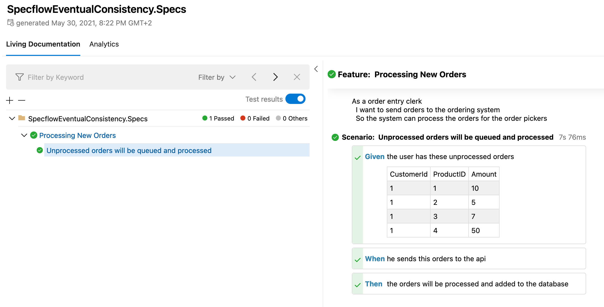

# Specflow and Eventual Consistency

{term}`SpecFlow` is a tool which can be used to describe test scenarios and automate the tests. Although I have been using SpecFlow for a while now I never used it for advanced examples where time might be an issue. Lets show a simple example scenario first. A scenario, written in {term}`Gherkin` looks like this:

```gherkin
Scenario: Add simple item with due date
    Given the user enters "wash my car"
    And the user adds a due date of "1-1-2022"
    When the user saves the item
    Then the item "wash my car" is added to the list
    And the due date is "1-1-2022"
```

This scenario is easy to implement, the item will be added and stored. That's it. Easy to verify, no delays, straight forward. But what if you have some microservices with a queueing mechanism? A scenario where data will be queued before processing so we can't exactly know when the data is processed?

# Testing with eventual consistency

*[Eventual consistency](https://www.google.com/url?sa=t&rct=j&q=&esrc=s&source=web&cd=&cad=rja&uact=8&ved=2ahUKEwixw9mBnurwAhWIB2MBHSIlCpAQFjAHegQIBhAD&url=https%3A%2F%2Fen.wikipedia.org%2Fwiki%2FEventual_consistency&usg=AOvVaw0DHqhPsspV7JLvL38t1Wjs) is a consistency model used in distributed computing to achieve high availability that informally guarantees that, if no new updates are made to a given data item, eventually all accesses to that item will return the last updated value* ([Wikipedia](https://www.google.com/url?sa=t&rct=j&q=&esrc=s&source=web&cd=&cad=rja&uact=8&ved=2ahUKEwixw9mBnurwAhWIB2MBHSIlCpAQFjAHegQIBhAD&url=https%3A%2F%2Fen.wikipedia.org%2Fwiki%2FEventual_consistency&usg=AOvVaw0DHqhPsspV7JLvL38t1Wjs)).

So, lets create a system with some microservices. The [Container Diagram](https://c4model.com/) looks like this:

```{include} ./container-diagram.pu

```

It is a simple API with a bunch of REST endpoints so we are able to create orders and retrieve processed orders. When orders are posted, they will be queued and processed by a worker, the worker has an artificial delay of 5 seconds so it acts like a long running process. When we want to create an automated test we could write a specification like this:


```gherkin
Feature: Processing New Orders
  As an order entry clerk
  I want to send orders to the ordering system
  So the system can process the orders for the order pickers

  Scenario: Unprocessed orders will be queued and processed
    Given the user has these unprocessed orders
      | CustomerId | ProductID | Amount |
      | 1          | 1         | 10     |
      | 1          | 2         | 5      |
      | 1          | 3         | 7      |
      | 1          | 4         | 50     |
    When he sends this orders to the api
    Then the orders will be processed and added to the database
```

# Implementation

Before we run the tests we want to make sure all orders for the customer are removed. Since we are testing against a testing environment this shouldn't be a problem.

```csharp
[BeforeScenario]
public async Task SetupTestUsers() =>
    await _api.DeleteOrdersForCustomer(customerId: 1);
```

By using [Polly](https://github.com/App-vNext/Polly) we can catch exeptions of a specific type. In this case, we catch exceptions of the type ```XUnitException``` because this is the type that will be thrown when the assert fails. When Polly catches an exception it will retry a number of times, while it waits for some time in between te retries. This way it is possible to create a test that verifies a few times if the orders are processed without specifying an exact duration.

```csharp

[Then("the orders will be processed and added to the database")]
public async Task ThenTheOrdersWillBeProcessedAndAddedToTheDatabase()
{
    var newOrders = _scenarioContext.Get<IEnumerable<Order>>("ORDERS");
    var retry = Policy
        .Handle<XunitException>()
    	.WaitAndRetryAsync(3, retryAttempt => TimeSpan.FromSeconds(3), (exception, timeSpan, context) => 
        {
	        // NOTHING TO DO HERE, JUST WAIT
	    });

    await retry.ExecuteAsync(async () =>
    {
	var processedOrders = await _api.GetAllOrders();
	processedOrders.Count().Should().Be(newOrders.Count()); 
    });
}
```

Check the full implementation on [GitHub](https://github.com/jacobduijzer/SpecflowEventualConsistency/blob/main/src/SpecflowEventualConsistency.Specs/ProcessNewOrdersSteps.cs).

# Report




You can get the full project on [GitHub](https://github.com/jacobduijzer/SpecflowEventualConsistency).